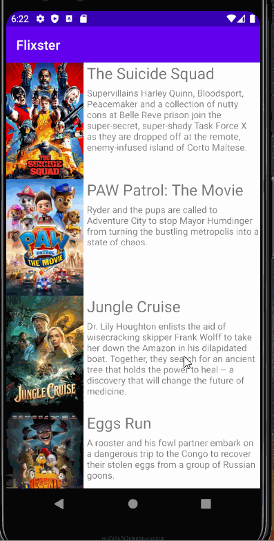
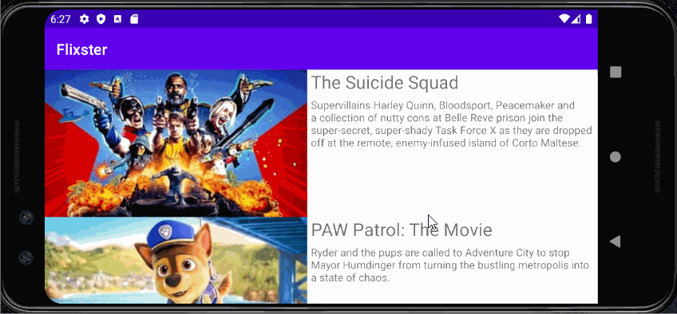

# Flixster
Flixster is an app that allows users to browse movies from the [The Movie Database API](http://docs.themoviedb.apiary.io/#).

📝 `NOTE - PASTE PART 2 SNIPPET HERE:` Paste the README template for part 2 of this assignment here at the top. This will show a history of your development process, which users stories you completed and how your app looked and functioned at each step.

---

## Flix Part 1

### User Stories

- User can view a list of movies (title, poster image, and overview) currently playing in theaters from the Movie Database API.

- Views responsive for both landscape/portrait mode.
   - In portrait mode, the poster image, title, and movie overview is shown.
   - In landscape mode, the rotated alternate layout uses the backdrop image instead and show the title and movie overview to the right of it.

### App Walkthough GIF

 

 

### Notes
Describe any challenges encountered while building the app.

### Open-source libraries used

- [Android Async HTTP](https://github.com/codepath/CPAsyncHttpClient) - Simple asynchronous HTTP requests with JSON parsing
- [Glide](https://github.com/bumptech/glide) - Image loading and caching library for Androids
